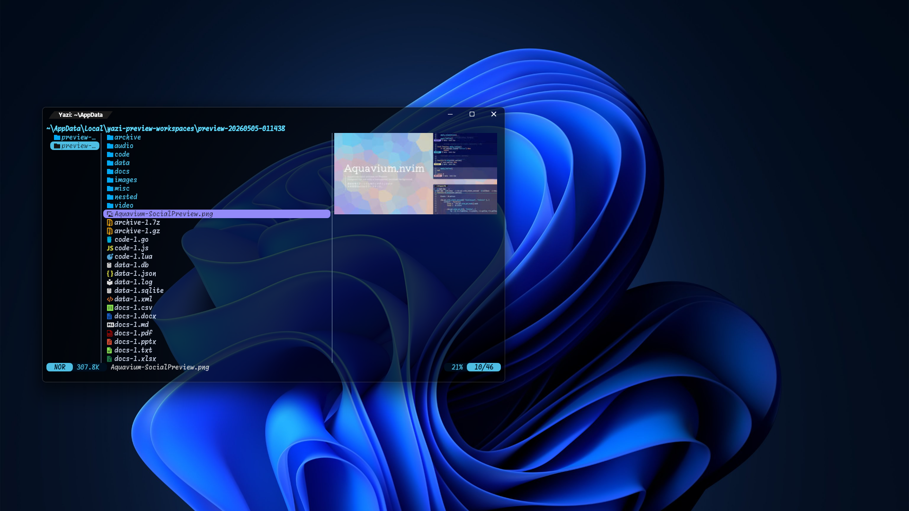
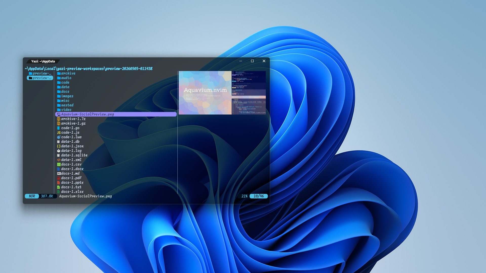
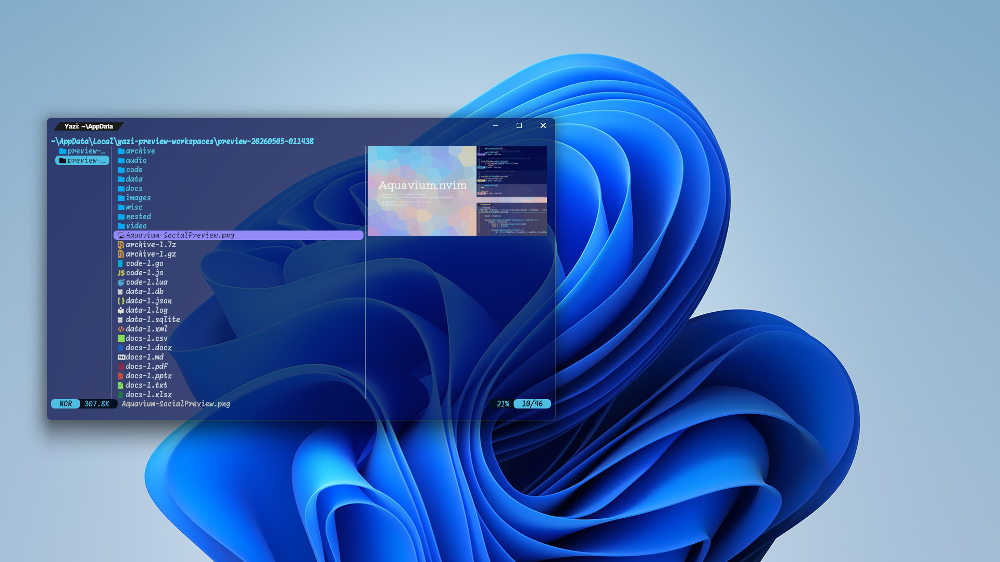

# Aquazium.yazi 📂
##### Aquavium color scheme on Yazi
<hr>


## ✨ 概要 - Overview -
<sub>Aquazium.yazi is a theme for Oh My Posh that </sub><br>
Aquazium.yaziは、NeovimのカラースキームであるAquavium.nvimを、  
<sub>uses the Aquavium.nvim color scheme</sub><br>
Yaziのテーマとして使用するためのテーマです。  
<br>
<sub>Please see the [T-b-t-nchos/Aquavium.nvim/README.md](https://github.com/T-b-t-nchos/Aquavium.nvim/blob/main/README.md) for details about Aquavium.</sub><br>
Aquaviumについての詳細は[T-b-t-nchos/Aquavium.nvim/README.md](https://github.com/T-b-t-nchos/Aquavium.nvim/blob/main/README.md)を参照してください。


## 📷️ プレビュー - Preview -

|TermColor|dark-wallpaper|light-wallpaper|
|---|---|---|
|black|||
|blue|||


## 💼 依存関係 - Dependents -
- [yazi](https://github.com/sxyazi/yazi)

## 🔧 インストール - Install -
### In terminal
```
ya pkg upgrade T-b-t-nchos/aquazium
```
### In your yazi.toml
```toml
[theme]
name = "aquazium"
```
